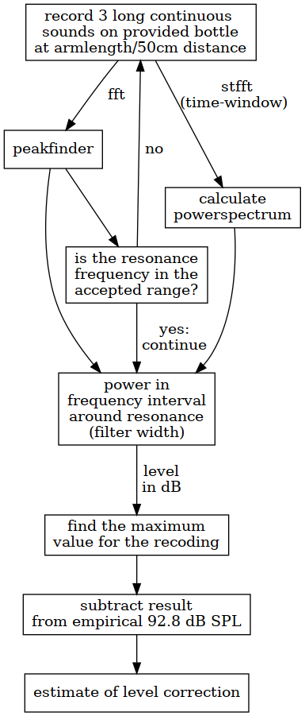

# MicrophoneCalibrationEstimator




install with
```console
$ #inside the project do:
$ python3 -m venv venv
$ source venv/bin/activate
$ pip install -r requirements.txt 
```
   


run with
```console
$ ./levelMeterBottle_tool.py exampleSounds/recording1.wav 
```


get help with
```console
$ ./levelMeterBottle_tool.py -h
```
