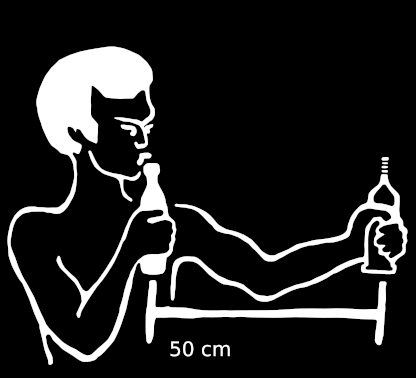

# MicrophoneCalibrationEstimator


Record data like this:


Install with:
```console
#inside the project do:
python3 -m venv venv
source venv/bin/activate
pip install -r requirements.txt 
```

Run with:
```console
./levelMeterBottle_tool.py exampleSounds/recording1.wav 
```

Get help with:
```console
./levelMeterBottle_tool.py -h
```

Working principle:

